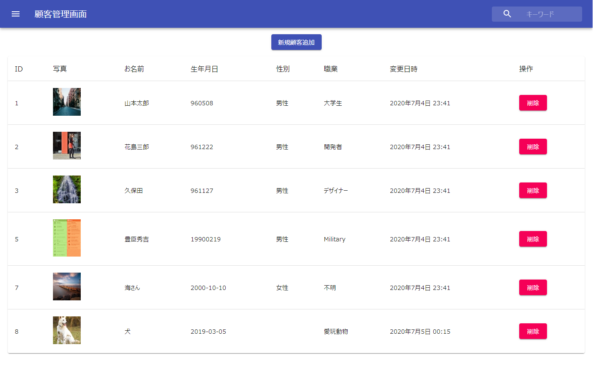

このプロジェクトはreact.jsとnode.jsを採用して顧客管理画面を作るサンプルです。

## 構成

・Frontend　react.js

・Backend　node.js + mysql

## デザイン

・Material UI

## 環境構築

 npm install -g nodemon
 
 yarn
 
 cd frontend && yarn
 
 データベースは db_dump/react_crud_db.sql　から構築してください。

## 動作確認

データベース接続情報は「database.json」ファイルで設定してください。

yarn dev

## スクリーンショット

## もっと勉強したい

詳しく勉強したい方はこちらをご覧ください。
[Create React App documentation](https://facebook.github.io/create-react-app/docs/getting-started)

[React documentation](https://reactjs.org/)
